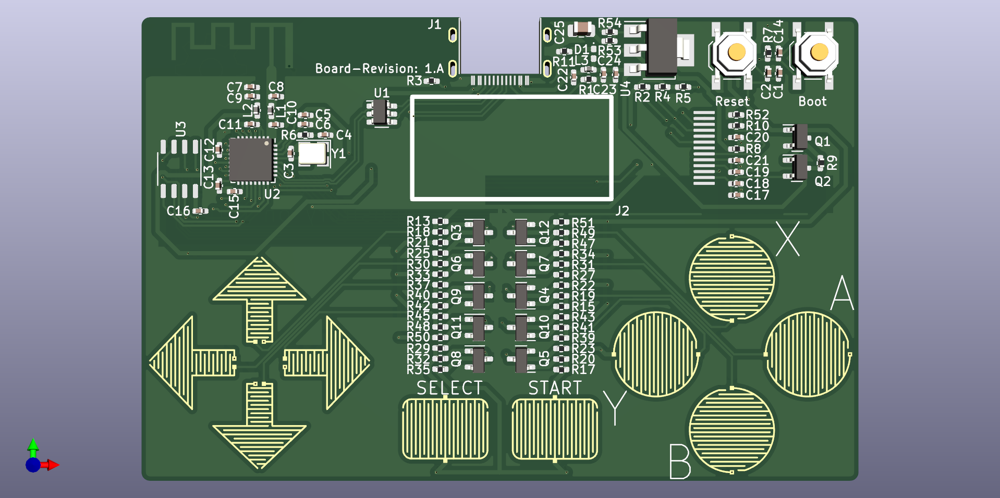
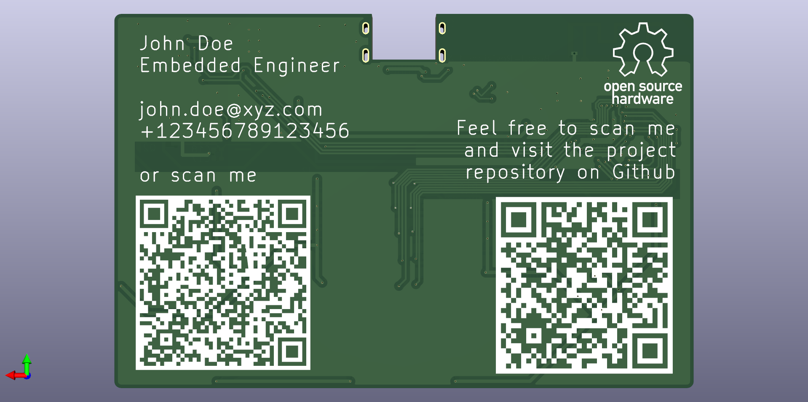
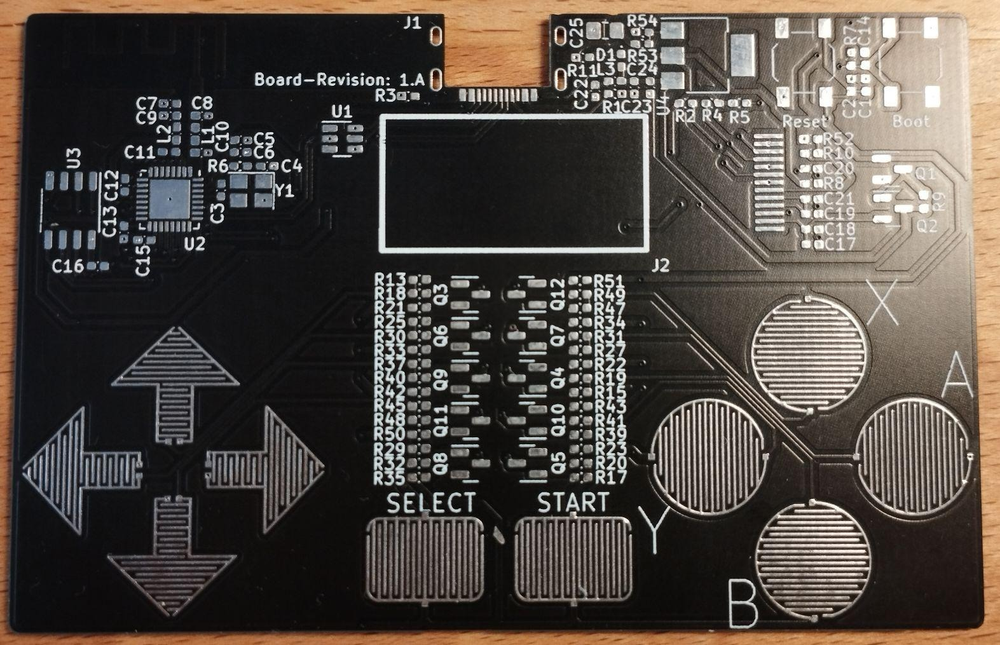

# system-on-a-business-card (SoBC)

The System on a Business Card is a miniature system in the size of a business card.
It is controlled by a ESP32-C3 microncontroller which shall run Zephyr RTOS in the future.
Since this goal is to also use the PCB is a business card, the predominant factor is the size which is 55x85 mm which seems to be the standard, at least for Europe.

A interactive Bill of Materials for the latest released board revision can be found [here](KiCAD/system-on-a-business-card/bom/ibom.html).
Alternatively, if you have the repositoy open on Github, please use this [link](https://htmlpreview.github.io0/?https://github.com/epsilon-0311/system-on-a-business-card/blob/main/KiCAD/system-on-a-business-card/bom/ibom.html). 

For further details on how to customize the desing to add your contact details please have a look at [Customization of the PCB](KiCAD/doc/README.md#Customization-of-the-PCB).

## Hardware Design

The system uses the on-board USB Type C recepticle for power delivery and a ESP32-C3 as its host.
As the microcontroller also supports Bluetooth and Wifi the design includes a PCB antenna as well.
One of the most prominent elements of the board is 0.77 inch OLED screen which is used to display various graphics.
Instead of using typical low profile buttons the board has resistive touch pads for the main controls.
More details on the harware design can be found [here](KiCAD/doc/README.md).

Design renderings of a revision 1.A PCB:

Finished board revision 1.A PCB:

## Zephyr
At the moment I'm working on getting Zephyr running.
A basic hardware configuration for the board is already available inside the Zephyr directory.
It builds and a minimal example is also available.
Unfortunately, I'm still waiting on my parts to finish the boards of my first batch.

As soon as I have a functioning board configuration, the goal is to submit the board to Zephry such that is officially supported.
Further, Zephyr currently does not support the used OLED dispaly controller (SSD1312).
Therefore, an additional goal is to submit a driver to the Zephyr project.